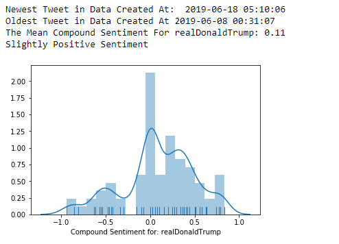
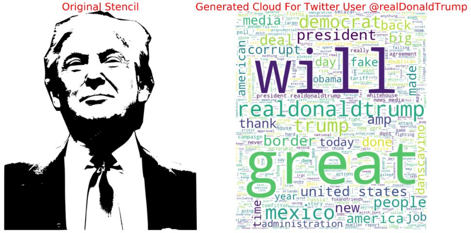

# Twitter Sentiment Analysis
A Twitter app that uses the vaderSentiment library in the natural language tool kit to perform lexicographic sentiment analysis.
There are two visualizations; one distribution plot of compound sentiment scores(calculated by the vaderSentiment library),
the other plot is a custom stencil based word cloud visualization. This program uses 100 tweets scraped from
search or a user profile to perform sentiment analysis.

#### Example Plots 

